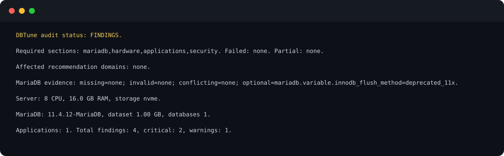

<div align="center">
  <h1>dbtune</h1>
  <p><strong>Evidence-based MariaDB tuning for RunCloud-hosted WordPress and WooCommerce.</strong></p>
  <p>
    <a href="#overview">Overview</a> &middot;
    <a href="#lifecycle">Lifecycle</a> &middot;
    <a href="#read-only-quickstart">Quickstart</a> &middot;
    <a href="#safety-model">Safety</a> &middot;
    <a href="#supported-environment">Support</a> &middot;
    <a href="#pinned-attested-installation">Install</a> &middot;
    <a href="#documentation">Docs</a>
  </p>
  <p>
    <a href="https://github.com/petervazan93/wooptima-db-tuner/actions/workflows/ci.yml"></a>
    <a href="https://github.com/petervazan93/wooptima-db-tuner/releases/tag/v0.3.0"></a>
    
    
  </p>
</div>



<p align="center"><sub>Current-source English output captured from a deterministic test fixture and sanitized to exclude server identity, addresses, paths, database names, credentials, and production evidence.</sub></p>

## Overview

`dbtune` is a single-artifact Bash tool that audits a RunCloud host, measures its MariaDB workload, and turns the collected evidence into reviewable server and application recommendations.

- **Audit the whole decision context.** Inspect effective MariaDB variables, hardware and storage, WordPress/WooCommerce applications, database inventory, grants, and listener exposure.
- **Measure before proposing.** Collect workload samples for 7 days by default, reject degraded or restart-affected intervals, and keep unknown evidence out of active changes.
- **Review every result.** Generate a Markdown report, flat JSON, a proposed MariaDB CNF, and provenance manifests that bind the proposal to one audit and measurement cycle.
- **Keep mutation operator-controlled.** Audit and proposal generation do not apply configuration. Apply, restart, verification, and rollback are separate explicit steps.

> [!IMPORTANT]
> The latest published release is `v0.3.0`, with immutable artifact version `0.3.0`. The current source branch is preparing v0.4.0 with an English default, explicit `DBTUNE_UI_LANG=sk`, and the `fleet-v3` report contract. The pinned installation below installs published v0.3.0 and does not include those v0.4.0 localization or report features.

## Lifecycle

```text
audit -> collect -> analyze -> report -> propose -> apply -> verify
                                                   |        |
                                                   +-> rollback
```

| Phase | What happens |
| --- | --- |
| `audit` | Reads MariaDB, host, application, and security evidence; starts a new measurement cycle. |
| `collect` | Samples workload behavior for 7 days by default and preserves the selected interface language for unattended completion. |
| `analyze` | Evaluates valid samples and current values against the versioned tuning rules. |
| `report` / `propose` | Produces operator-reviewable findings, read-only diagnostic actions, and a hash-bound CNF proposal. |
| `apply` | Runs pre-publication live-value, provenance, backup, target, and topology checks; atomically publishes the candidate, then runs daemon configuration validation. A validation failure restores the exact prior target or absent topology, or enters recovery if restoration cannot complete. |
| `verify` / `rollback` | Checks the deployed snapshot after restart or restores the prior filesystem state without requiring SQL. |

Every successful audit creates a new `run_id`, archives the previous active cycle, and invalidates its downstream measurement and proposal artifacts. Existing apply and recovery history remains available.

## Read-only quickstart

After installation, start with the terminal summary or machine-readable audit:

```bash
sudo dbtune audit
sudo dbtune audit --json
```

Audit is read-only with respect to MariaDB and system configuration. It creates root-owned state artifacts under `/var/lib/dbtune` and starts a new measurement cycle; it does not apply tuning, restart MariaDB, or execute application actions.

An authoritative audit requires complete `mariadb`, `hardware`, `applications`, and `security` sections. Classified results use exit status `0` for `PASS` or `FINDINGS`, `2` for `UNKNOWN`, and `1` for `ERROR`. Usage, dependency, and validation errors may use statuses `64` and above.

## Safety model

- **Fail closed on incomplete evidence.** Missing, malformed, conflicting, unsupported, or unknown required current values cannot become active server changes.
- **Bind recommendations to evidence.** Audit, sample, analysis, and proposal hashes prevent mixing artifacts across runs or changing a reviewed proposal before normal apply.
- **Require measurements for normal apply.** The normal path expects state `proposed`, at least 288 valid samples, and a matching proposal manifest.
- **Treat backup status independently.** Fresh authoritative backup evidence is checked at apply time. Confirmed missing, stale, future, or malformed evidence blocks apply; only an absent artifact or a valid `unknown` artifact can enter a separate exact TTY confirmation path.
- **Keep hard stops in force mode.** `--force` can bypass the measurement/analysis-manifest requirement and the local time window, but not live-value validation, Galera, mydumper, backup, target, configuration-validation, or rollback guards.
- **Publish atomically, then validate and recover.** Before publication, apply checks ownership, modes, links, parent identity, target topology, live values, provenance, and backup evidence. It atomically publishes the complete candidate with Linux rename primitives, then runs daemon configuration validation. A validation failure uses the same guarded atomic path to restore the exact prior target or absent topology; if restoration or bookkeeping cannot complete, durable intent and recovery state preserve the recovery path.
- **Make restart explicit.** Apply does not restart MariaDB unless `--restart` is supplied. The normal RunCloud workflow uses a manual panel restart followed by `verify --post` and later `verify --24h`.

Read the full operational contract in the [rollout runbook](docs/RUNBOOK.md) before using `apply`.

## Supported environment

| Area | Contract |
| --- | --- |
| MariaDB families accepted by the rules engine | 10.6, 10.11, and 11.x |
| MariaDB lifecycle integration coverage | 10.6 and 11.4 |
| Target deployment | Linux RunCloud host with systemd |
| CI operating system | Ubuntu 24.04 |
| Applications | RunCloud-hosted WordPress and WooCommerce; WP-CLI is optional for eligible diagnostic actions |
| Runtime | Bash 4+, standard GNU/Linux tools, `flock`, and a MariaDB/MySQL client |
| Authoritative host evidence | `findmnt`, `lsblk`, `ss`, `free`, and `pgrep` for the corresponding audit domains |
| Apply, rollback, and recovery | Python 3 with `dir_fd`, Linux `renameat2`, systemd, and a MariaDB daemon validation command |
| Database authentication | Root socket authentication or a defaults file; credentials are not placed in command arguments or logs |

CI coverage does not imply that every Ubuntu release or every MariaDB 11.x minor version has been integration-tested. Galera/wsrep nodes are detected and blocked from apply.

## Pinned, attested installation

The production-oriented path pins a published release, verifies the installer against its offline GitHub artifact-attestation bundle, lets you inspect it, and only then executes it with privileges. It never pipes remote code into a root shell.

```bash
release=v0.3.0
curl --proto '=https' --tlsv1.2 -fsSLo install.sh \
  "https://github.com/petervazan93/wooptima-db-tuner/releases/download/$release/install.sh"
curl --proto '=https' --tlsv1.2 -fsSLo dbtune-attestation.jsonl \
  "https://github.com/petervazan93/wooptima-db-tuner/releases/download/$release/dbtune-attestation.jsonl"
gh attestation verify install.sh \
  --bundle dbtune-attestation.jsonl \
  --repo petervazan93/wooptima-db-tuner \
  --signer-workflow petervazan93/wooptima-db-tuner/.github/workflows/release.yml \
  --source-ref "refs/tags/$release" \
  --deny-self-hosted-runners
less install.sh
sudo sh install.sh --version "$release"
```

This pinned procedure currently installs `v0.3.0`; it does not install the upcoming v0.4.0 interface. Bundle verification does not require `gh auth login` or an API token. The installer then verifies the selected `dbtune` artifact's SHA-256 checksum, GitHub attestation, fixed upstream repository and owner, signer workflow, exact release source ref, and Bash syntax before atomically publishing `/usr/local/bin/dbtune`. It does not run an audit or change MariaDB.

The installer requires POSIX `sh`, Linux, `curl`, `gh`, Bash 4+, `install`, `stat`, a SHA-256 tool, and `sudo` for a privileged destination. See [Security](SECURITY.md#installation) for mirror and trust-policy details.

## CLI

The current source interface is:

```text
dbtune audit [--json]
dbtune collect start [--days N] [--long-query-time SECONDS]
dbtune collect status | stop
dbtune analyze [--min-samples N]
dbtune report | propose
dbtune apply [--restart] [--force]
dbtune verify --post | --24h
dbtune rollback
dbtune status | version
dbtune _tick
```

The upcoming v0.4.0 source defaults to English. Slovak is selected explicitly for the executable and installer with `DBTUNE_UI_LANG=sk`; only `en` and `sk` are accepted. Commands, options, paths, keys, enums, booleans, schema versions, and exit statuses are never localized. Published v0.3.0 does not implement this selector.

## Documentation

- [Rollout runbook](docs/RUNBOOK.md): lifecycle, safety gates, pilot, apply, verification, rollback, recovery, and artifact contracts.
- [Read-only pilot audit](docs/PILOT-AUDIT.md): bounded one-time audit procedure and stop conditions.
- [Tuning methodology](mariadb-runcloud-preset.md): rules, formulas, evidence requirements, and operational rationale.
- [Security policy](SECURITY.md): install provenance, trust boundaries, and private vulnerability reporting.
- [Architecture and behavior plan](PLAN.md): source structure, stable machine contracts, and detailed implementation behavior.

## Development

```bash
make build
make check
make test
make integration
```

`make check` validates shell syntax and uses ShellCheck when available. `make test` builds the single `dist/dbtune` artifact and runs the Bats unit suite when Bats is installed. Docker integration exercises the real artifact against MariaDB 10.6 and 11.4; unavailable Docker is a failure when integration is required by CI.

## Security

Review [SECURITY.md](SECURITY.md) before deployment. Report vulnerabilities privately through [GitHub Private Vulnerability Reporting](https://github.com/petervazan93/wooptima-db-tuner/security/advisories/new), and never include production credentials or unredacted audit artifacts in a public issue.
