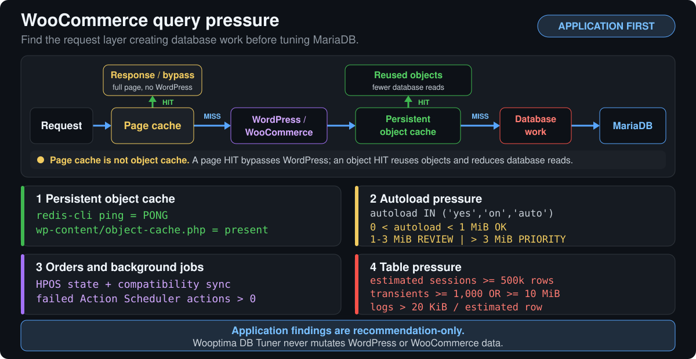
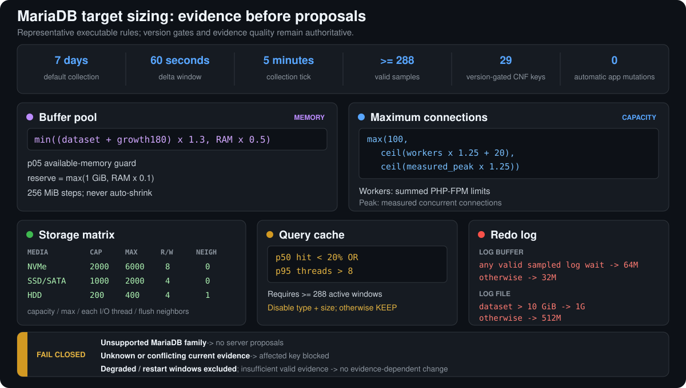

<div align="center">
  <h1>Wooptima DB Tuner</h1>
  <p><strong>Evidence-based MariaDB tuning for RunCloud-hosted WordPress and WooCommerce.</strong></p>
  <p>
    <a href="#overview">Overview</a> &middot;
    <a href="#woocommerce-tuning-scope">Tuning scope</a> &middot;
    <a href="#how-mariadb-targets-are-calculated">Decision logic</a> &middot;
    <a href="#safety-model">Safety</a> &middot;
    <a href="#pinned-installation">Install</a> &middot;
    <a href="#documentation">Docs</a>
  </p>
  <p>
    <a href="https://github.com/petervazan93/wooptima-db-tuner/actions/workflows/ci.yml"></a>
    <a href="https://github.com/petervazan93/wooptima-db-tuner/releases/tag/v0.4.1"></a>
    
    
  </p>
</div>


<p align="center"><sub>Current-source English output captured from a deterministic test fixture and sanitized to exclude server identity, addresses, paths, database names, credentials, and production evidence.</sub></p>

## Overview

Wooptima DB Tuner is a single-artifact Bash tool that audits a RunCloud host, measures its MariaDB workload, and turns the collected evidence into reviewable server and application recommendations.

- **Audit the whole decision context.** Inspect effective MariaDB variables, hardware and storage, WordPress/WooCommerce applications, database inventory, grants, and listener exposure.
- **Measure before proposing.** Collect workload samples for 7 days by default, reject degraded or restart-affected intervals, and keep unknown evidence out of active changes.
- **Review every result.** Generate a Markdown report, flat JSON, a proposed MariaDB CNF, and provenance manifests that bind the proposal to one audit and measurement cycle.
- **Keep mutation operator-controlled.** Audit and proposal generation do not apply configuration. Apply, restart, verification, and rollback are separate explicit steps.

> [!IMPORTANT]
> The latest published release is `v0.4.1`, with immutable artifact version `0.4.1`. The executable defaults to English, selects Slovak explicitly with `DBTUNE_UI_LANG=sk`, and uses the `fleet-v3` report contract.

## WooCommerce tuning scope

Wooptima DB Tuner starts at the application layer because page caching, object reuse, autoloaded options, order storage, background jobs, and table waste determine how much work reaches MariaDB. Application findings are recommendation-only: `dbtune` never mutates WordPress or WooCommerce data and does not perform automatic cleanup.

<picture>
  <source media="(max-width: 1100px)" srcset="assets/woocommerce-query-pressure-mobile.svg">
  
</picture>

<p align="center"><sub>Application-first diagnostic flow. Thresholds are executable rules, not production measurements or benchmark claims.</sub></p>

| Application check | Evidence and recommendation boundary |
| --- | --- |
| Persistent object cache | Requires a successful Redis probe (`redis-cli ping = PONG`) and `wp-content/object-cache.php`; reports Redis down, a missing drop-in, or unknown evidence. |
| Redis policy | Recommends `maxmemory-policy=volatile-lru` when the observed policy differs. It does not size Redis memory or make eviction decisions. |
| Autoloaded options | Sums option values where `autoload IN ('yes','on','auto')`: `0 < total < 1 MiB` is OK, 1-3 MiB needs review, and above 3 MiB is high priority. Zero emits no autoload verdict. |
| HPOS | Recommends migration when HPOS is off and legacy orders exist; flags compatibility sync when HPOS and data sync are both on because it causes duplicate writes. It does not reconcile HPOS row counts. |
| WooCommerce sessions | Flags an estimated row count of at least 500,000 for cleanup review, then supplies the exact read-only count shown below. |
| Action Scheduler | Flags any failed actions for investigation. Current production audit does not collect retention, so it does not drive retention recommendations. |
| Database transients | Flags at least 1,000 records or at least 10 MiB of option values for cleanup review. |
| Plugin log tables | Flags tables whose estimated payload exceeds 20 KiB per estimated row as purge candidates. |
| WP-Cron | Flags `DISABLE_WP_CRON=true` when no matching system cron can be confirmed; unknown application-to-cron mapping remains unknown. |
| `postmeta.meta_value` index | Flags a standalone `meta_value` index for review; compound indexes beginning with another column are not classified by this check. |

For a site using the detected WordPress table prefix, the session follow-up is:

```sql
SELECT COUNT(*) AS session_rows FROM `<prefix>woocommerce_sessions`;
```

Replace `<prefix>` with the detected prefix. All generated application follow-ups are operator-run, read-only diagnostics; they do not delete, update, or otherwise mutate application data. SQL follow-ups additionally use bounded connection and statement timeouts.

## How MariaDB targets are calculated

By default, `dbtune` collects workload evidence for 7 days on a 5-minute timer tick. Each tick measures a 60-second delta window. Analysis requires at least 288 valid samples by default, configurable with `dbtune analyze --min-samples N`, and excludes malformed rows, degraded intervals, and restart-affected intervals rather than allowing them to drive a proposal.

The rules engine combines those samples with the current MariaDB variables, dataset and growth history, RAM availability, summed PHP-FPM worker limits, measured connection peak, and detected storage class. It can evaluate 29 version-gated proposal keys, but it does not propose all 29 on every server and makes zero automatic WordPress or WooCommerce mutations.

<picture>
  <source media="(max-width: 1100px)" srcset="assets/mariadb-sizing-logic-mobile.svg">
  
</picture>

<p align="center"><sub>Representative executable rules. Version gates, current-value evidence, and sample quality remain authoritative for every proposal.</sub></p>

| Target | Executable decision logic |
| --- | --- |
| Buffer pool | Starts from `min((dataset + growth180) x 1.3, RAM x 0.5)`, rounds in 256 MiB steps, applies the p05 available-memory guard with `max(1 GiB, RAM x 0.1)` reserved, and never proposes an automatic shrink. |
| Maximum connections | Uses `max(100, ceil(workers x 1.25 + 20), ceil(measured_peak x 1.25))`, where workers are summed PHP-FPM limits and the peak includes measured concurrent connections. |
| Storage I/O matrix | Maps NVMe to `2000 / 6000 / 8 / 0`, SSD/SATA to `1000 / 2000 / 4 / 0`, and HDD to `200 / 400 / 4 / 1` for I/O capacity, capacity maximum, each read/write thread count, and flush neighbors. |
| Query cache | Requires the configured minimum of active query-cache windows, 288 by default. It proposes disabling both type and size when p50 hit rate is below 20% **or** p95 running threads is above 8; otherwise it keeps the current setting. |
| Redo log buffer | Selects 64 MiB when any valid sampled log wait exists; otherwise selects 32 MiB. |
| Redo log file | Selects 1 GiB when the dataset is above 10 GiB; otherwise selects 512 MiB. |
| Durability | When binary logging is disabled, may propose `innodb_flush_log_at_trx_commit=1`; `innodb_doublewrite=1` remains the pinned durability target. |

Some collected metrics are diagnostic only. A value becomes proposal-driving evidence only where an executable rule consumes it. An unsupported MariaDB family blocks all server proposals; an unknown required current value or conflicting evidence blocks the affected key; malformed, degraded, and restart windows are excluded; and insufficient valid evidence prevents evidence-dependent changes.

<details>
<summary><strong>All 29 version-gated proposal keys</strong></summary>

**Evidence-sized and storage (9):** `innodb_buffer_pool_size`, `max_connections`, `innodb_io_capacity`, `innodb_io_capacity_max`, `innodb_read_io_threads`, `innodb_write_io_threads`, `innodb_flush_neighbors`, `innodb_log_file_size`, `innodb_log_buffer_size`.

**Query and working-set cache (5):** `query_cache_type`, `query_cache_size`, `tmp_table_size`, `max_heap_table_size`, `key_buffer_size`.

**Durability, startup, and flushing (8):** `innodb_flush_log_at_trx_commit`, `innodb_doublewrite`, `innodb_flush_method`, `innodb_buffer_pool_dump_at_shutdown`, `innodb_buffer_pool_load_at_startup`, `innodb_max_dirty_pages_pct`, `innodb_max_dirty_pages_pct_lwm`, `innodb_lock_wait_timeout`.

**Connections and table metadata (3):** `skip_name_resolve`, `thread_cache_size`, `table_definition_cache`.

**Slow-query observability (4):** `slow_query_log`, `slow_query_log_file`, `long_query_time`, `log_slow_verbosity`.

These are proposal-capable schema keys, not 29 changes on every server. Each key still requires supported-version and valid-current-value evidence; notably, `innodb_flush_method` is proposal-capable only before MariaDB 11, where the rule treats it as deprecated.

</details>

## Lifecycle

```text
audit -> collect -> analyze -> report -> propose -> apply -> verify
                                                   |        |
                                                   +-> rollback
```

| Phase | What happens |
| --- | --- |
| `audit` | Reads MariaDB, host, application, and security evidence; starts a new measurement cycle. |
| `collect` | Samples workload behavior for 7 days by default and preserves the selected interface language for unattended completion. |
| `analyze` | Evaluates valid samples and current values against the versioned tuning rules. |
| `report` / `propose` | Produces operator-reviewable findings, read-only diagnostic actions, and a hash-bound CNF proposal. |
| `apply` | Runs pre-publication live-value, provenance, backup, target, and topology checks; atomically publishes the candidate, then runs daemon configuration validation. A validation failure restores the exact prior target or absent topology, or enters recovery if restoration cannot complete. |
| `verify` / `rollback` | Checks the deployed snapshot after restart or restores the prior filesystem state without requiring SQL. |

Every successful audit creates a new `run_id`, archives the previous active cycle, and invalidates its downstream measurement and proposal artifacts. Existing apply and recovery history remains available.

## Read-only quickstart

After installation, start with the terminal summary or machine-readable audit:

```bash
sudo dbtune audit
sudo dbtune audit --json
```

Audit is read-only with respect to MariaDB and system configuration. It creates root-owned state artifacts under `/var/lib/dbtune` and starts a new measurement cycle; it does not apply tuning, restart MariaDB, or execute application actions.

An authoritative audit requires complete `mariadb`, `hardware`, `applications`, and `security` sections. Classified results use exit status `0` for `PASS` or `FINDINGS`, `2` for `UNKNOWN`, and `1` for `ERROR`. Usage, dependency, and validation errors may use statuses `64` and above.

## Safety model

- **Fail closed on incomplete evidence.** Missing, malformed, conflicting, unsupported, or unknown required current values cannot become active server changes.
- **Bind recommendations to evidence.** Audit, sample, analysis, and proposal hashes prevent mixing artifacts across runs or changing a reviewed proposal before normal apply.
- **Require measurements for normal apply.** The normal path expects state `proposed`, at least 288 valid samples, and a matching proposal manifest.
- **Treat backup status independently.** Fresh authoritative backup evidence is checked at apply time. Confirmed missing, stale, future, or malformed evidence blocks apply; only an absent artifact or a valid `unknown` artifact can enter a separate exact TTY confirmation path.
- **Keep hard stops in force mode.** `--force` can bypass the measurement/analysis-manifest requirement and the local time window, but not live-value validation, Galera, mydumper, backup, target, configuration-validation, or rollback guards.
- **Publish atomically, then validate and recover.** Before publication, apply checks ownership, modes, links, parent identity, target topology, live values, provenance, and backup evidence. It atomically publishes the complete candidate with Linux rename primitives, then runs daemon configuration validation. A validation failure uses the same guarded atomic path to restore the exact prior target or absent topology; if restoration or bookkeeping cannot complete, durable intent and recovery state preserve the recovery path.
- **Isolate daemon validation output from `mysql`.** When `--validate-config` is available, configuration validation uses a `root:mysql` mode `0710` parent and keeps probe and validation logs as root-owned mode `0600` files. Only its dedicated MariaDB validation datadir is owned by `mysql:mysql` and writable at mode `0700`. The fallback keeps the root-owned capture workspace and does not create a mysql-writable datadir.
- **Make restart explicit.** Apply does not restart MariaDB unless `--restart` is supplied. The normal RunCloud workflow uses a manual panel restart followed by `verify --post` and later `verify --24h`.

Read the full operational contract in the [rollout runbook](docs/RUNBOOK.md) before using `apply`.

## Supported environment

| Area | Contract |
| --- | --- |
| MariaDB families accepted by the rules engine | 10.6, 10.11, and 11.x |
| MariaDB lifecycle integration coverage | 10.6 and 11.4 |
| Target deployment | Linux RunCloud host with systemd |
| CI operating system | Ubuntu 24.04 |
| Applications | RunCloud-hosted WordPress and WooCommerce; WP-CLI is optional for eligible diagnostic actions |
| Runtime | Bash 4+, standard GNU/Linux tools, `flock`, and a MariaDB/MySQL client |
| Authoritative host evidence | `findmnt`, `lsblk`, `ss`, `free`, and `pgrep` for the corresponding audit domains |
| Apply, rollback, and recovery | Python 3 with `dir_fd`, Linux `renameat2`, systemd, and a MariaDB daemon validation command |
| Database authentication | Root socket authentication or a defaults file; credentials are not placed in command arguments or logs |

CI coverage does not imply that every Ubuntu release or every MariaDB 11.x minor version has been integration-tested. Galera/wsrep nodes are detected and blocked from apply.

## Pinned installation

Prerequisites: Linux, Bash 4+, `curl`, `gh`, and permission to write the installation destination.

```bash
curl -fsSL https://github.com/petervazan93/wooptima-db-tuner/releases/download/v0.4.1/install.sh | sh -s -- --version v0.4.1
```

> [!WARNING]
> This pipeline trusts the remote `install.sh` before it verifies the downloaded `dbtune` artifact. For the verify-before-run procedure that authenticates and lets you inspect `install.sh` first, follow [Security: Installation](SECURITY.md#installation).

This command installs the published `v0.4.1` release. For a privileged destination, the installer places the artifact in a root-owned mode `0644` non-executable staging inode, then verifies its SHA-256 checksum, GitHub attestation, fixed upstream repository and owner, signer workflow, exact release source ref, Bash syntax, and embedded version. It changes that same inode to mode `0755`, directly executes the staged path for its executable version smoke check, and atomically publishes the same inode only after all checks pass. It does not run an audit or change MariaDB.

## CLI

The current source interface is:

```text
dbtune audit [--json]
dbtune collect start [--days N] [--long-query-time SECONDS]
dbtune collect status | stop
dbtune analyze [--min-samples N]
dbtune report | propose
dbtune apply [--restart] [--force]
dbtune verify --post | --24h
dbtune rollback
dbtune status | version
dbtune _tick
```

The v0.4.1 executable and installer default to English. Slovak is selected explicitly with `DBTUNE_UI_LANG=sk`; only `en` and `sk` are accepted. Commands, options, paths, keys, enums, booleans, schema versions, and exit statuses are never localized.

## Documentation

- [Rollout runbook](docs/RUNBOOK.md): lifecycle, safety gates, pilot, apply, verification, rollback, recovery, and artifact contracts.
- [Read-only pilot audit](docs/PILOT-AUDIT.md): bounded one-time audit procedure and stop conditions.
- [Tuning methodology](mariadb-runcloud-preset.md): rules, formulas, evidence requirements, and operational rationale.
- [Security policy](SECURITY.md): install provenance, trust boundaries, and private vulnerability reporting.
- [Architecture and behavior plan](PLAN.md): source structure, stable machine contracts, and detailed implementation behavior.

## Development

```bash
make fast
make build
make check
make test
make test-timing
make integration
```

`make fast` is an eight-test local smoke gate. `make check` validates shell syntax and uses ShellCheck when available. `make test` builds the single `dist/dbtune` artifact and runs the Bats unit suite when Bats is installed. `make test-timing` runs the complete timed unit suite. Full unit and integration gates remain required before review and release. Docker integration exercises the real artifact against MariaDB 10.6 and 11.4; unavailable Docker is a failure when integration is required by CI.

## Security

Review [SECURITY.md](SECURITY.md) before deployment. Report vulnerabilities privately through [GitHub Private Vulnerability Reporting](https://github.com/petervazan93/wooptima-db-tuner/security/advisories/new), and never include production credentials or unredacted audit artifacts in a public issue.
